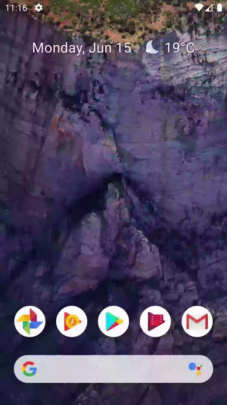

 

Flutter is Google's UI toolkit for building beautiful, natively compiled applications for mobile, web, and desktop from a single codebase. Flutter works with existing code, is used by developers and organizations around the world, and is free and open source.

## About Xylophone

This repository features a music app that plays sounds from a xylophone. For every Beethoven there is, this will allow you to unleash your musical talent wherever you are.

## What you will need

[SDK](https://dart.dev/get-dart), a Software Development Kit of Flutter that gives us the necessary tools to develop multiplatform applications. In addition to using an IDE like [Android Studio](https://developer.android.com/studio/), [IntelliJ IDEA](https://www.jetbrains.com/idea/) with the Dart plugin or  [Visual Studio Code](https://code.visualstudio.com/) with the Dart Code extension.
